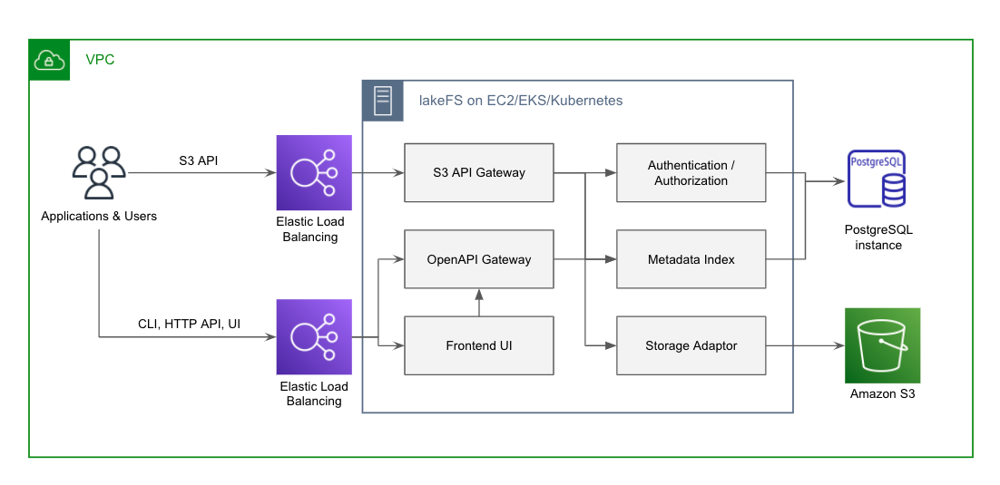
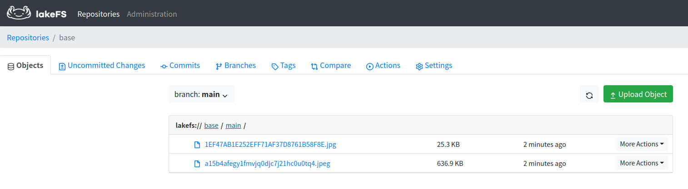
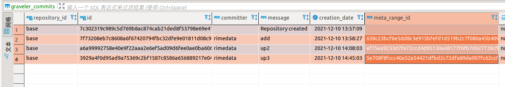
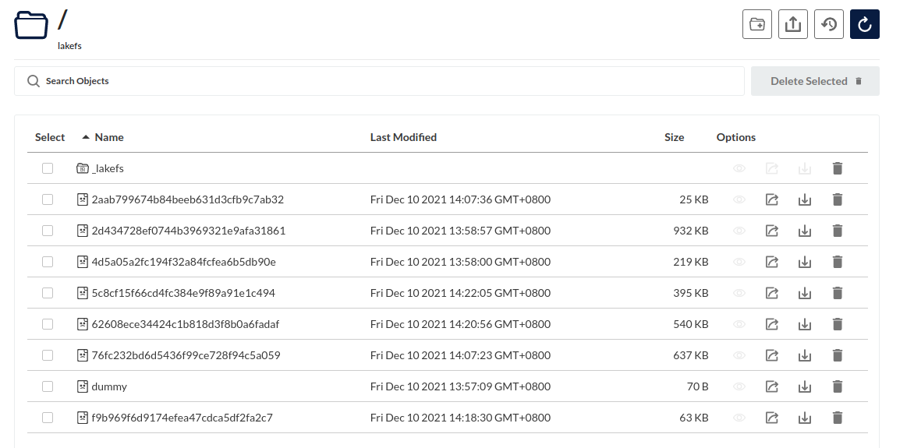

# lakefs 调研

## 软件设计

数据存储:  s3

metadata 存储: PostgreSQL

本身无状态即可 轻松大规模部署

### Metadata

Lakefs 中的提交为不可变提交  

存储 commits id 信息 和 未commit数据信息

lakefs 团队未来的计划: 

> 我们计划通过嵌入Raft来消除对 RDBMS 的需求，以在一组机器上复制这些写入，并将数据本身存储在 RocksDB 中。为了方便操作，复制的 RocksDB 数据库会定期快照到底层对象存储。

### 服务组成

- s3 api gateway
- open api
- s3 storage adapter (标准interface 适配不同底层存储结构)
- web ui
- auth server

### 基础概念

- Repositories 存储库

类似 namespace 将 对象、分支和提交组合在一起 相当于 Bucket

- Branches  分支

概念参考 Git 分支 ， 新开一个分支 实际上为 创建当前 存储库的一致性快照 

- Commits

提交是不可变的“检查点”，包含在给定时间点的存储库的**完整快照**

- Objects

文件即对象

### 基础功能

当前数据: Objects 下  
历史数据: Commit下

1. x1.png 文件 push 到 仓库下   
2. 然后   commit  
3. 如果该文件被删除   就可以通过commit 历史记录 恢复 x1.png 数据  

1. x1.png 文件 push 到 仓库下   没有commit  
2. 提交同名 x1.png 文件   
3. 第一次提交的文件当没有记录   (文件 还是存在在 minio中 但没有这个关系了  lakefs无法恢复)

graveler_staging_kv 表 记录 当时 提交到Objects 下 未 commit的数据    同名文件会覆盖记录

具体历史数据 以二进制方式  存在 在minio 当前 `bucket` 的  `_lakefs` 目录 下  

pgsql中 commit表 字段 meta_range_id 对应这minio中的具体记录文件(这个文件是记录关系 而非具体文件)

